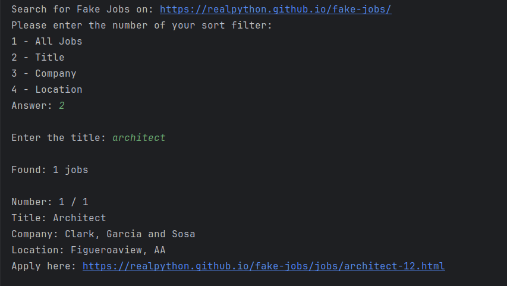

<h1>Web Scraping using BeautifulSoup in Python</h1>
 
<h2>Features</h2>
<ul>
    <li> Retrieving DOM HTML </li>
    <li> Function to find all jobs from website </li>
    <li> Function to filter jobs based on title, company and location</li>
    <li> Length of jobs found </li>
    <li> Links of each job provided </li>
    <li> User input friendly handling exceptions </li>
    <li> Website used: https://realpython.github.io/fake-jobs/ </li>
</ul>

<h2>Acknowledgments</h2>

<b> Python3: http://bit.ly/python3-certifications <b>
 

<h2>Photo</h2>

 

<h2>Contact</h2>

<b> Email: mariusc0023@gmail.com </b>
